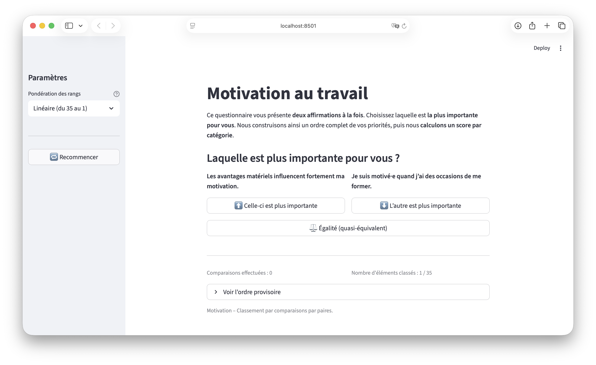

# Work Motivation – Pairwise Ranking

## Table of Contents

- [Overview](#overview)
- [Features](#features)
- [Usage](#usage)
- [Installation](#installation)
- [Dependencies](#dependencies)
- [Files](#files)
- [Methodology](#methodology)
- [License](#license)

---

## Overview

The **[Work Motivation – Pairwise Ranking](https://motivation-paires.streamlit.app)** app is an interactive tool built with **Streamlit**.  
It helps identify your **main sources of professional motivation** by comparing statements two at a time.



Each comparison contributes to a **personalized ranking** and a **category-based motivation score**.

---

## Features

- Questionnaire with **35 statements** across **7 motivation categories**:  
  - Stability / Routine / Security  
  - Variety / Novelty  
  - Learning  
  - Money  
  - Relationship  
  - Power / Influence  
  - Autonomy  

- **Pairwise comparison algorithm**: users select which statement matters most to them.  
- **Automatic score calculation** (linear weighting from 35 to 1).  
- **Result visualization** through charts and tables.  
- **CSV export** for both detailed results and category scores.  
- Automatic progress saving with `st.session_state`.

---

## Usage

1. Launch the app (see *Installation* section).  
2. Read the two statements and click on the one that feels **more important** to you.  
3. Repeat until the test ends.  
4. View your results:  
   - Complete ranking of your statements.  
   - Category-based motivation scores with charts.  
   - CSV exports for detailed data.

You can restart the test anytime using the 🔁 button in the sidebar.

---

## Installation

### On macOS, Linux or Windows

Open a terminal, navigate to the folder containing `streamlit_app.py`, then run:

```bash
streamlit run streamlit_app.py
```

The app will open automatically in your default web browser.  
If not, open the address displayed (usually [http://localhost:8501](http://localhost:8501)).

---

## Dependencies

- Python **3.11** or higher  
- Main libraries:

```bash
pip install streamlit pandas numpy
```

A `requirements.txt` file is provided for Streamlit Cloud deployment.

---

## Files

| File | Description |
|------|--------------|
| `streamlit_app.py` | Main Streamlit application |
| `requirements.txt` | Required Python dependencies |
| `screenshot.png` | Optional app screenshot |

---

## Methodology

This test is based on theories of **intrinsic and extrinsic motivation**, drawing from **McClelland** and **Deci & Ryan**.

- Each statement receives a linear weight (35 points for rank 1, 1 point for rank 35).  
- **Category score** = sum of the 5 questions in each category, normalized by the theoretical maximum (35+34+33+32+31 = 165) × 100.  
- Results are expressed as percentages and visualized with bar charts.

The purpose is to identify your **key motivational drivers** and understand what truly fuels your professional engagement.

---

## License

MIT License  
© 2025 — Gauthier Rammault
